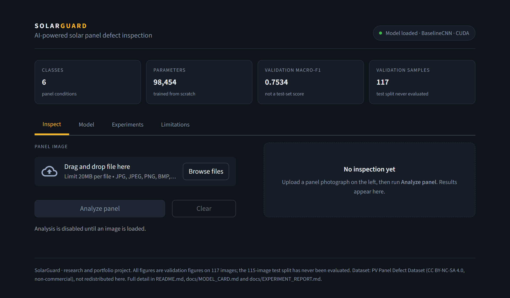
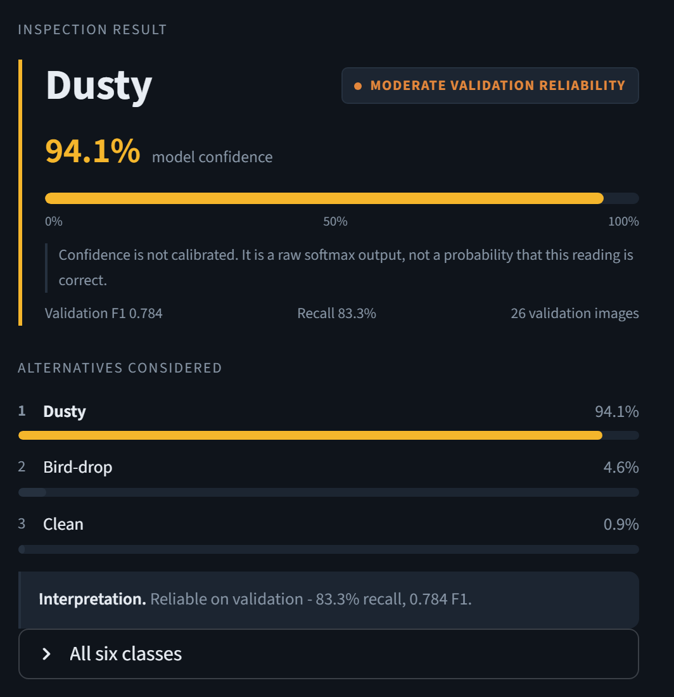

# SolarGuard

Solar-panel defect classification across six visual conditions, built as an exercise in
**reproducible ML engineering** rather than leaderboard chasing. The repository contains a fully
audited pipeline over a 1,574-image dataset, from which 772 verified-unique image paths were
selected as the modeling population after duplicate and label-conflict removal; a leakage-safe
train/validation/test split; a compact 98,454-parameter CNN baseline; and three controlled
single-variable experiments — two of which produced **inconclusive or negative results that are
reported as such**. Every number below is reproducible from a fixed seed and a saved checkpoint.



The local Streamlit application. The header strip carries the model's actual scale and
its validation macro-F1, labelled as such — there is no test-set score to show.



A single inspection. Confidence is shown large because it is what a user reads first, and
labelled uncalibrated immediately underneath because it is a softmax output rather than a
probability of being correct. The per-class validation F1, recall and sample count travel
with the prediction, so the result carries its own error bars. Pictured is a validation
image classified as Dusty.

---

## Problem

Utility-scale solar farms lose measurable output to surface conditions that are cheap to fix but
expensive to find: dust accumulation, bird droppings, snow cover, physical cracking, and
electrical damage. Manual inspection does not scale to tens of thousands of panels. Automated
image classification can triage panels from drone or handheld photographs — but the useful
question is not "what is the highest accuracy achievable." It is **which defects can be detected
reliably, and how confident can we be in that claim given the available data**. This project is
built around answering the second question honestly.

---

## Key Features

- **Audited dataset pipeline** — SHA-256 exact-duplicate detection and perceptual-hash (dHash)
  near-duplicate clustering over the full raw dataset, with every exclusion logged and reversible.
- **Leakage-safe splitting** — grouped by near-duplicate cluster so no image and its near-copy can
  land on opposite sides of the split; verified by automated tests, not by policy alone.
- **Structural test-set isolation** — no code path exists that can construct a test `DataLoader`
  during training or model selection.
- **Multi-seed experimentation** — every comparison runs three seeds (42, 123, 456) so effect
  sizes are judged against seed-to-seed variance instead of a single lucky run.
- **Bit-reproducible training** — two independent runs of the same configuration produced
  byte-identical histories, checkpoints, and metrics.
- **Checkpoint validation** — reported metrics are recomputed by reloading the selected best
  checkpoint, not carried over from the training loop's in-memory state.
- **Class-level evaluation** — per-class precision/recall/F1 and confusion matrices for every run.
- **113 automated tests** covering data integrity, leakage, preprocessing determinism, loss
  correctness, checkpointing, seeding, and inference.
- **Local inference application** — a Streamlit UI serving a verified 406 KB deployment
  checkpoint, with serving preprocessing proven identical to validation preprocessing by test.

---

## Dataset

**Source:** [PV Panel Defect Dataset](https://www.kaggle.com/datasets/alicjalena/pv-panel-defect-dataset)
(Kaggle, CC BY-NC-SA 4.0 — non-commercial). The dataset is **not redistributed in this
repository**; `data/` is gitignored except for image-free metadata. See [`DATASET.md`](DATASET.md)
for full provenance notes and download instructions.

**Dataset size vs. modeling population.** The dataset comprises **1,574 images**, of which **77%
are exact byte-level duplicates** (509 duplicate groups, verified independently). After excluding
duplicates, near-duplicates, and 18 images sitting in unresolved label-conflict clusters, **772
verified-unique image paths** remain, and it is these 772 that the manifest references and the
controlled experiments train and validate on.

The two numbers describe different things and are kept distinct throughout: **1,574 is the size of
the dataset on disk**, while **772 is the number of manifest paths used by the experiments**. All
1,574 files remain present and unmodified; the 772 are a selected subset of them. The raw 1,574
count is never treated as 1,574 pieces of independent evidence.

**Split** (seed 42, stratified by class, grouped by near-duplicate cluster):

| Split | Images |
|---|--:|
| Train | 540 |
| Validation | 117 |
| Test | 115 (untouched) |

**Six classes and their training distribution:**

| Class | Train n | % of train | Class weight |
|---|--:|--:|--:|
| Clean | 126 | 23.3% | 0.7143 |
| Dusty | 123 | 22.8% | 0.7317 |
| Snow-Covered | 100 | 18.5% | 0.9000 |
| Bird-drop | 87 | 16.1% | 1.0345 |
| Electrical-damage | 58 | 10.7% | 1.5517 |
| Physical-Damage | 46 | 8.5% | 1.9565 |

**Imbalance ratio: 2.73:1** (Clean vs Physical-Damage). This is why **macro-F1 is the primary
metric** — it averages per-class F1 without weighting by class size, so a model that performs well
on the two largest classes (Clean and Dusty, 46% of training data combined) while failing on the
two rarest cannot hide behind an aggregate score. Accuracy and weighted-F1 are reported alongside
it, but never used for model selection.

**Verified image properties:** 0 corrupt files, 453 distinct resolutions, median 720x632 px,
aspect ratios from 1.0 to 3.6. All images are resized to 224x224 with ImageNet normalization.

---

## Model

`BaselineCNN` (`src/solarguard/models/baseline_cnn.py`) — **98,454 trainable parameters**:

| Stage | Layers | Output |
|---|---|---|
| Input | — | 3 x 224 x 224 |
| Blocks 1–4 | Conv3x3 → BatchNorm → ReLU → MaxPool2x2 | 16 → 32 → 64 → 128 channels |
| Head | GlobalAveragePool → Dropout(0.5) → Linear(128 → 6) | 6 logits |

Deliberately small. Its purpose is to be a well-understood floor that any future transfer-learning
model must clear — not to maximize accuracy on its own. Two design choices are worth noting:

- **Global average pooling instead of Flatten+FC.** A flatten head on the 128x14x14 feature map
  would need a 25,088-wide weight matrix, dwarfing every convolution and encouraging the model to
  memorize *where* a defect appeared. Since dust, cracks, and droppings can appear anywhere in
  frame, translation invariance is a real property of the task, not just regularization.
- **Raw logits out.** `forward()` never applies softmax; the loss applies `log_softmax` internally.

**Loss:** class-weighted cross-entropy, with inverse-frequency weights computed from `train.csv`
only — never from validation or test labels.

---

## Experimental Methodology

**Locked baseline.** One reference run (seed 42, epoch 23 checkpoint) is frozen and never
modified. All subsequent work is compared against it and against a 3-seed baseline arm.

**Multi-seed evaluation.** A single training run cannot separate a real effect from seed noise.
Every experiment runs **seeds 42, 123, 456** on both arms, reported as mean ± std. This decision
was itself evidence-driven: the baseline's own seed-to-seed macro-F1 standard deviation is
**0.0381** — roughly 4.5 validation samples wide — which sets the floor any experiment must exceed
to be believable.

**Controlled single-variable experiments.** Each experiment changes exactly one thing, verified
mechanically rather than asserted. For Experiment 3, all 28 configuration keys were parsed and
diffed to confirm a single functional difference, and the resolved transform pipelines were
compared object-by-object.

**Checkpoint selection.** Highest validation macro-F1 across epochs, with a `min_delta` of 1e-4 so
floating-point noise cannot count as improvement, ties broken by lowest validation loss. Early
stopping fires after 15 epochs without improvement.

**Metric recomputation.** Reported per-class metrics come from **reloading the selected best
checkpoint and re-running inference**, not from the training loop's cached values — which also
verifies that checkpoints round-trip faithfully.

**Test data untouched.** The 115-image test split has never been loaded, evaluated, or used for
any decision — architecture, hyperparameters, augmentation, loss, or checkpoint selection. This is
enforced structurally: `build_train_val_dataloaders()` contains no code path capable of
constructing a test loader. Using test data to choose between experiments would convert it into a
second validation set and make any final number optimistically biased.

---

## Results

### Locked baseline (single reference run, seed 42, epoch 23)

| Metric | Value |
|---|--:|
| Accuracy | 0.7692 |
| Macro precision | 0.7639 |
| Macro recall | 0.7504 |
| **Macro F1** | **0.7534** |
| Weighted F1 | 0.7744 |
| Validation loss | 0.8091 |

### Multi-seed comparison (seeds 42, 123, 456 — same data, split, model, optimizer, and LR)

| Arm | Change from baseline | Macro-F1 | Accuracy | Weighted-F1 | Status |
|---|---|---|---|---|---|
| **Baseline** | — (weighted cross-entropy) | 0.7629 ± 0.0381 | 0.7892 ± 0.0261 | 0.7872 ± 0.0278 | reference |
| **Exp 2: Focal loss (gamma=2)** | loss function only | 0.7441 ± 0.0216 | 0.7635 ± 0.0197 | 0.7625 ± 0.0203 | **rejected** |
| **Exp 3: No rotation** | rotation augmentation removed | 0.7729 ± 0.0244 | 0.7977 ± 0.0300 | 0.7958 ± 0.0254 | **provisionally kept** |

### What is and is not statistically established

**Nothing in this table is statistically established.** Both experiments produced effects smaller
than the baseline's own seed-to-seed standard deviation of 0.0381.

**Experiment 2 — Focal loss: rejected.** Macro-F1 change **-0.0189**, winning on only 1 of 3
seeds, 95% CI [-0.0685, +0.0308] containing zero. The hypothesis was that focal loss would help
Bird-drop, which is confusable rather than rare. It did not — Bird-drop got *worse* (-0.041),
while the only gain landed on Physical-Damage, the rarest class, contradicting the proposed
mechanism. **Focal loss did not demonstrate a reliable improvement over weighted cross-entropy on
this dataset.** One confound remains: focal loss also caused systematically earlier stopping (mean
best epoch 46 → 27), so those models may be undertrained rather than inferior.

**Experiment 3 — No rotation: provisionally kept, on grounds other than the mean.** Macro-F1
change **+0.0100** — about one quarter of the noise floor, 95% CI [-0.0413, +0.0612] containing
zero, winning 2 of 3 seeds. **This does not demonstrate improved generalization.** It was retained
for three reasons that do not depend on the mean:

1. Rotation was measured to black out **~5.53% of pixels on average (max 10.08%) in ~91% of
   training images** — an artifact present in **0%** of validation images, i.e. a train/eval
   distribution gap created by augmentation itself.
2. Seed-to-seed standard deviation dropped **0.0381 → 0.0244 (~36% reduction)**, and the worst
   seed improved from 0.7189 to 0.7447. Removing rotation appears to eliminate a failure mode in
   which training stalled early.
3. All four aggregate metrics moved in the same direction, unlike Experiment 2 which degraded
   three of four.

The defensible claim is **"a better-specified preprocessing pipeline that did no harm and reduced
variance"** — not "an improvement in generalization."

---

## Class-Level Performance

Locked baseline, per-class F1 on the 117-image validation set:

| Class | F1 | Validation n |
|---|--:|--:|
| Electrical-damage | 0.889 | 13 |
| Snow-Covered | 0.884 | 22 |
| Clean | 0.863 | 27 |
| Dusty | 0.784 | 26 |
| **Physical-Damage** | **0.556** | 10 |
| **Bird-drop** | **0.545** | 19 |

The two weakest classes fail for different reasons. **Physical-Damage** has only 10 validation
images, so a single prediction moves its F1 by roughly 0.10 — its score is as much a measurement
artifact as a model property. **Bird-drop** is the more interesting failure: with 19 validation
and 87 training images it is *not* among the rarest classes, and its inverse-frequency class
weight (1.0345) is essentially neutral — so frequency-based rebalancing gives it no help at all.
Its problem is visual confusability, not scarcity.

---

## Error Analysis

Aggregated confusion matrix across the 3-seed baseline arm (351 predictions; rows = true,
columns = predicted):

| true / pred | Bird-drop | Clean | Dusty | Electrical | Physical | Snow |
|---|--:|--:|--:|--:|--:|--:|
| **Bird-drop** | **38** | 7 | 5 | 4 | 0 | 3 |
| **Clean** | 7 | **67** | 4 | 0 | 2 | 1 |
| **Dusty** | 5 | 3 | **65** | 1 | 1 | 3 |
| **Electrical-damage** | 3 | 1 | 1 | **33** | 1 | 0 |
| **Physical-Damage** | 10 | 3 | 1 | 1 | **14** | 1 |
| **Snow-Covered** | 3 | 1 | 0 | 0 | 2 | **60** |

Three observations follow directly from these counts:

1. **Physical-Damage to Bird-drop is the single dominant error mode.** 10 of 30 Physical-Damage
   instances (33%) are predicted as Bird-drop — more than twice any other confusion in the matrix,
   and the reason Physical-Damage recall is only 46.7%. Both classes present as small, localized,
   high-contrast irregularities on an otherwise uniform panel surface; at 224x224 the distinction
   between a crack and a dropping is fine-grained.
2. **Bird-drop accumulates the highest false-positive count of any class.** It absorbs 28 false
   positives distributed across all five other classes while achieving only 66.7% recall itself —
   the model over-predicts Bird-drop relative to its support. This combination of high
   false-positive volume and low recall indicates poor inter-class separability for this category
   rather than a well-defined decision boundary.
3. **The three easiest classes are the visually global ones.** Snow-Covered (90.9% recall),
   Electrical-damage (84.6%), and Dusty (83.3%) all change the appearance of the *whole* panel
   rather than a small region — exactly what a 98K-parameter CNN with global average pooling is
   best positioned to detect.

---

## What We Learned

1. **Focal loss was not demonstrated to improve macro-F1.** A well-motivated hypothesis, tested
   properly, produced a negative result — and the mechanism it predicted (helping the confusable
   Bird-drop class) did not materialize. Reported as a rejection rather than quietly dropped.
2. **An augmentation was actively corrupting training data.** `RandomRotation(15)` defaults to
   `fill=0`, blacking out ~5.53% of pixels in ~91% of training images — an artifact absent from
   every validation image. This was found by *measuring* the augmentation pipeline rather than
   trusting its configuration.
3. **Removing that augmentation reduced variance more than it moved the mean.** A ~36% reduction
   in seed-to-seed standard deviation, with the worst seed improving most, is a more useful
   outcome than a small mean shift — but it is still not proof of better generalization.
4. **Seeding bugs are silent and expensive.** Model weights were being initialized *before*
   `set_seed()` was called, so "seed 42" did not actually control initialization. Two runs of an
   identical configuration differed by 0.057 macro-F1 before this was found and fixed.
5. **The model is not overfitting — it is capacity- and data-limited.** Training loss sits *above*
   validation loss in every run, meaning augmentation already makes training harder than
   evaluation. That is direct evidence that adding *more* augmentation is the wrong direction, and
   it correctly predicted Experiment 2's failure.
6. **Validation size caps what can be proven.** With 117 validation images, one flipped prediction
   is worth 0.0085 macro-F1 while the baseline's seed noise is 0.0381. Any effect smaller than
   roughly 0.06 is undetectable at three seeds. Knowing this in advance is what allowed both
   experiments to be reported honestly instead of over-claimed.
7. **Dataset quantity, class imbalance, and label quality are the likely ceiling** — not the loss
   function or the augmentation policy. 540 training images across six classes, with 46 examples
   of the rarest, is the binding constraint.

---

## Reproducibility

Reproducibility here is a verified property, not an aspiration. Two independent runs of an
identical configuration produced **byte-identical** results across all 83 epochs of `history.csv`,
identical confusion matrices, identical classification reports, and **bit-identical model weights**
in the saved checkpoint.

**Seeding** (`set_seed()` in `src/solarguard/training/train.py`) covers Python `random`, NumPy,
PyTorch CPU and CUDA, plus `cudnn.deterministic=True` and `benchmark=False`. `set_seed()` is called
**before model construction**, so weight initialization is genuinely governed by the seed. The
DataLoader receives a seeded generator and a `worker_init_fn` so augmentation randomness is
reproducible across worker processes.

**Saved per run** (`experiments/<arm>/seed_<n>/`):

```
checkpoint_best.pt          model + optimizer state, epoch, config, class mapping, seed
history.csv                 per-epoch train/val loss, accuracy, macro-F1, weighted-F1, LR, time
metrics.json                headline + per-class precision/recall/F1 from the best checkpoint
classification_report.json  full per-class breakdown
confusion_matrix.csv        raw counts
config.yaml                 complete training configuration
class_mapping.json          class-to-index mapping
training_curves.png         loss and macro-F1 curves with the best epoch marked
```

**To reproduce:**

```bash
pip install -e ".[dev]"
pip install torch torchvision   # not pinned in pyproject.toml: Colab ships its own CUDA build
# 1. obtain the dataset (see DATASET.md) into data/candidates/PV_Panel_Defect_Dataset/
python scripts/build_manifest.py        # rebuild the deduplicated, leakage-safe split (seed 42)
python scripts/compute_statistics.py    # dataset statistics + leakage/label/duplicate verification
python -m pytest tests/                 # 113 tests
python scripts/run_seed_sweep.py --arm baseline   # or: focal | norot
```

**Honest limit:** GPU reproducibility is verified on identical hardware. Results are *not*
guaranteed to match bit-for-bit across different GPU architectures, since cuDNN may select
different algorithms.

---

## Project Structure

```
Solar_Guard/
├── configs/
│   ├── preprocessing.yaml            # baseline preprocessing + augmentation
│   └── preprocessing_norot.yaml      # Exp 3 variant: rotation disabled (1 key differs)
├── data/                             # gitignored except image-free metadata
│   ├── splits/                       # manifest.csv, train/val/test.csv, class_mapping.json
│   ├── processed/                    # hashes, duplicate clusters, EXIF, audit tables
│   └── final/                        # dataset_statistics.json, exclusions.csv
├── experiments/
│   ├── baseline_cnn/                 # locked baseline + early reproducibility runs
│   ├── baseline_3seed/               # 3-seed reference arm
│   ├── exp2_focal_gamma2/            # Experiment 2 (rejected)
│   └── exp3_no_rotation/             # Experiment 3 (provisionally kept)
├── app/
│   └── streamlit_app.py              # local inference UI
├── models/
│   └── solarguard_baseline_v1.pt     # 406 KB deployment checkpoint (tracked)
├── notebooks/
│   └── solarguard_colab_training.ipynb   # Colab GPU training entry point
├── scripts/
│   ├── build_manifest.py             # dedup + leakage-safe split construction
│   ├── compute_statistics.py         # dataset statistics + verification
│   ├── run_baseline_experiment.py    # single-run training entry point
│   ├── run_seed_sweep.py             # multi-seed controlled experiment runner
│   ├── export_deployment_checkpoint.py   # strip optimizer state -> deployment artifact
│   ├── generate_baseline_report.py   # per-class metrics from a saved checkpoint
│   └── smoke_test_phase3.py          # end-to-end pipeline smoke test
├── src/solarguard/
│   ├── data/                         # audit, hashing, duplicates, split, provenance, datasets
│   ├── preprocessing/transforms.py   # train and eval transform pipelines
│   ├── models/baseline_cnn.py        # BaselineCNN
│   ├── inference/predictor.py        # single-image inference for serving
│   ├── training/                     # config, losses, engine, train, checkpoint
│   └── evaluation/metrics.py         # accuracy, macro/weighted F1, per-class, confusion matrix
├── tests/                            # 113 tests
├── DATASET.md                        # dataset provenance, license, download instructions
├── PLANNING.md                       # full engineering log and decision record
└── pyproject.toml
```

---

## Limitations

- **Dataset size.** 540 training images across six classes; the rarest class has 46 training
  examples. This is small for image classification and is likely the binding constraint on
  performance.
- **Class imbalance.** 2.73:1 between the largest and smallest class. Handled with
  inverse-frequency weighted cross-entropy, but weighting cannot manufacture information that 46
  images do not contain.
- **Validation size caps statistical resolution.** With 117 validation images, one prediction is
  worth 0.0085 macro-F1. Physical-Damage has only 10 validation images, so its per-class F1 moves
  by ~0.10 per sample and should not be over-interpreted.
- **Nothing has been statistically established.** Both experiments produced effects smaller than
  seed noise. Three seeds per arm can detect only large effects; a realistic effect size would need
  more seeds to resolve.
- **Dataset provenance is imperfect.** The source is a community-uploaded Kaggle aggregation of
  images from multiple public web sources. The uploader's CC BY-NC-SA 4.0 license reflects their
  right to license the compilation; it does not establish that every underlying photograph's
  original rights-holder consented. No image is claimed as original work here, and none is
  redistributed.
- **Label quality is not independently verified.** 18 images were excluded for sitting in
  near-duplicate clusters carrying conflicting labels. The true label-error rate across the 772
  manifest paths is unknown — duplicate-based detection cannot catch a uniquely-photographed
  mislabeled image.
- **No source/panel grouping metadata exists.** The split is grouped by near-duplicate cluster,
  the strongest available substitute, but two genuinely different photographs of the same physical
  panel would not be grouped and could leak across splits undetected.
- **Domain shift.** Validation images come from the same aggregated dataset as training. Real user
  photographs will differ in camera, lighting, angle, and framing. Notably, real photos are often
  tilted — and Experiment 3 *removed* rotation augmentation, so the retained model has less tilt
  invariance. That cost is invisible to this validation set.
- **Test set never evaluated.** The 115-image test split remains untouched by design. No
  generalization claim beyond validation is made anywhere in this repository.

---

## Deployment

**A local Streamlit application exists. There is no public or production deployment.**

### What exists and has been verified

- **Deployment checkpoint** — `models/solarguard_baseline_v1.pt` (406 KB). Exported from the
  locked baseline by `scripts/export_deployment_checkpoint.py`, which strips
  `optimizer_state_dict` (1.21 MB → 406 KB) and verifies the remaining weights are
  **bit-identical** to the source. The source training checkpoint is opened read-only and
  confirmed unmodified by checksum.
- **Inference pipeline** — `src/solarguard/inference/predictor.py`. Loads the artifact, applies
  preprocessing, returns predicted class, top-k, and the full probability distribution.
- **Streamlit app** — `app/streamlit_app.py`. Verified to start and serve **HTTP 200** with no
  errors logged.
- **113/113 tests pass**, including 23 inference tests.

Two correctness properties are enforced by test rather than convention:

1. **Serving preprocessing is identical to validation preprocessing.** The predictor imports
   `build_eval_transform()` — the same function behind every validation metric in this repository —
   and a test asserts the two produce `torch.equal` tensors. They cannot drift apart silently.
2. **Class labels come from the checkpoint, not a separate file.** The artifact is self-describing,
   so an index/label mismatch cannot silently mislabel every prediction.

A spot check on 12 real validation images returned 10/12 correct, with both failures being
Physical-Damage predicted as Bird-drop — the documented dominant error mode. The deployment path
reproduces the model's known behaviour rather than something subtly different.

```bash
pip install -e ".[app]"
streamlit run app/streamlit_app.py
```

### What does not exist

No public endpoint, no hosted instance, no container configuration, no cloud deployment. **The
model is not production-ready and no such claim is made.**

### What would still be required before any production use

- **Test-set evaluation.** The 115-image test split has never been evaluated. Until it is, no
  unbiased generalization estimate exists.
- **Real-world evaluation** on photographs representative of an actual deployment setting, rather
  than a held-out slice of the same aggregated public dataset.
- **Confidence calibration.** The app displays softmax outputs and labels them uncalibrated,
  because no calibration analysis has been performed.
- **Failure-mode handling.** Physical-Damage recall is 46.7% — a naive deployment would miss over
  half of physically damaged panels. There is no abstention or escalate-to-human path.
- **Out-of-distribution rejection.** The model assigns one of six panel labels to any input,
  including images containing no solar panel at all.

The application surfaces these limitations in a persistent panel rather than hiding them.

---

## Future Improvements

None of the following have been done. They are listed in the order the evidence justifies:

1. **Transfer learning (MobileNetV2 / EfficientNet-B0).** The strongest lever available. The
   evidence says this model is capacity- and data-limited rather than overfitting, and pretrained
   ImageNet features address both. The training loop is already architecture-agnostic and would
   need no modification.
2. **More seeds per arm.** At three seeds, only effects larger than ~0.06 macro-F1 are detectable.
   Five to ten seeds would let realistic effect sizes be resolved.
3. **Revisit rotation with edge-fill instead of black-fill.** Experiment 3 removed rotation
   entirely, discarding tilt invariance along with the black-corner artifact. Rotation with
   replicate-padding would plausibly keep the benefit without the cost.
4. **Investigate the Physical-Damage / Bird-drop confusion directly.** It is the dominant error
   mode (33% of Physical-Damage instances). Higher input resolution or targeted data collection
   are the obvious candidates.
5. **Manual review of the 18 excluded label-conflict images**, plus a broader label audit of the
   retained set.
6. **Grad-CAM explainability**, to verify the model attends to actual defect regions rather than
   background or panel framing.
7. **Single, final test-set evaluation** — once, after all modeling decisions are frozen.
8. **Containerization and public deployment.** A local Streamlit application already exists
   (see Deployment); hosting it publicly should follow the test-set evaluation and
   calibration work above, not precede them.

---

## Tech Stack

| Component | Purpose |
|---|---|
| **PyTorch / torchvision** | Model, training loop, transforms (deliberately not version-pinned in `pyproject.toml`, so Colab's CUDA-matched build is used as provided) |
| **scikit-learn** | Metrics: accuracy, macro/weighted F1, per-class precision/recall, confusion matrix |
| **pandas** | Manifests, split files, per-epoch history, experiment summaries |
| **NumPy >= 2.0** | Vectorized perceptual-hash distance computation (`np.bitwise_count`) |
| **Pillow** | Image loading, decoding, format/mode inspection |
| **matplotlib** | Training curves and confusion-matrix figures |
| **PyYAML** | Preprocessing and experiment configuration |
| **pytest** | 113 automated tests |

Requires Python >= 3.10.

---

## License

Code, configuration, and documentation in this repository are MIT-licensed
(see [`LICENSE`](LICENSE)).

Two things are deliberately **not** covered by it. The **dataset** is CC BY-NC-SA 4.0
(non-commercial) and is not redistributed here — obtain it yourself per
[`DATASET.md`](DATASET.md). The **trained weights** in `models/` are a derivative of that
dataset and are released under the same CC BY-NC-SA 4.0 terms, so downstream use inherits
the non-commercial restriction. `LICENSE` sets out the reasoning.

---

## Author

**Ayush Dubey**

Dataset provenance and download instructions: [`DATASET.md`](DATASET.md).
